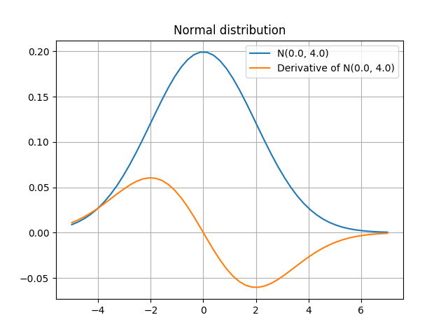

# Dual numbers
python で[二重数 ( dual numbers )](https://ja.wikipedia.org/wiki/%E4%BA%8C%E9%87%8D%E6%95%B0) を扱うための module を作成しました. dual.py を実行すると, 使用例が出力されます.

sample1.py は, dual.py を用いて自動微分により正規分布の導関数を計算するプログラムです. sample1.py を実行すると, 次の図を表示します.

sample2.py は, dual.py を用いて自動微分により2変数非線形力学系の相図（phase portrailt）を描画するサンプルスクリプトです.
